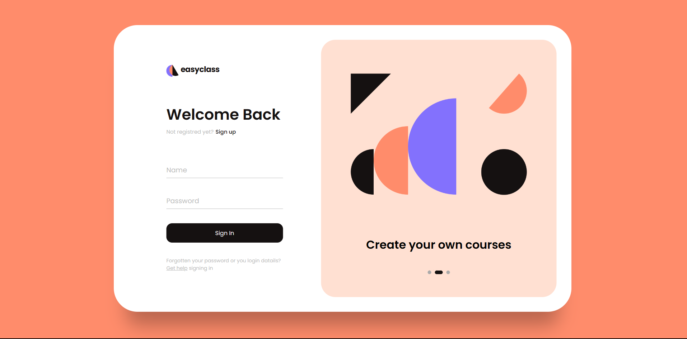
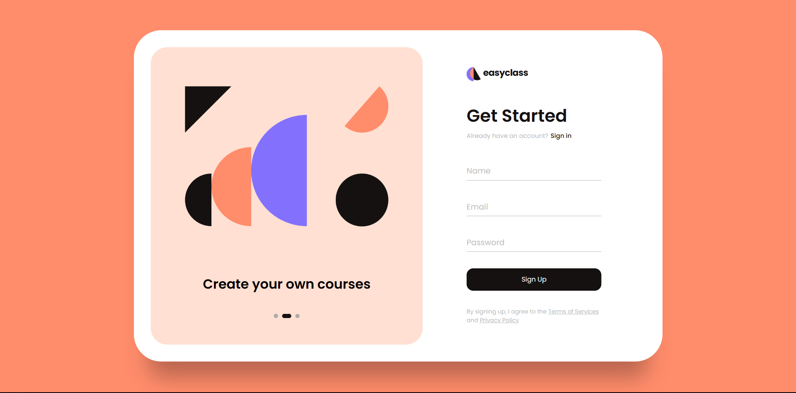

# Formulário EasyClass

Este é um projeto de formulário para a aplicação EasyClass. O formulário permite que os usuários façam login ou se cadastrem na plataforma EasyClass.
Não foi usado nenhum tipo de Banco de dados, Framework, Pré-processadores

## Recursos

- O formulário possui duas seções: "Login" e "Cadastro";
- Os usuários podem alternar entre as seções clicando nos botões "Sign in" e "Sign up";
- As imagens no carrossel são alteradas automaticamente a cada 3 segundos;
- Os usuários podem navegar entre as imagens do carrossel clicando nos marcadores na parte inferior;
- O formulário é responsivo e se adapta a diferentes tamanhos de tela.

## Tecnologias utilizadas

- HTML
- CSS
- JavaScript

## Como executar o projeto

1. Clone este repositório em sua máquina local:

3. Abra o arquivo `index.html` em seu navegador.

## Contribuição

Contribuições são bem-vindas! Se você tiver alguma sugestão, correção de bug ou melhoria, fique à vontade para abrir uma issue ou enviar um pull request.

## Licença

Este projeto está licenciado sob a [Licença MIT](LICENSE).
